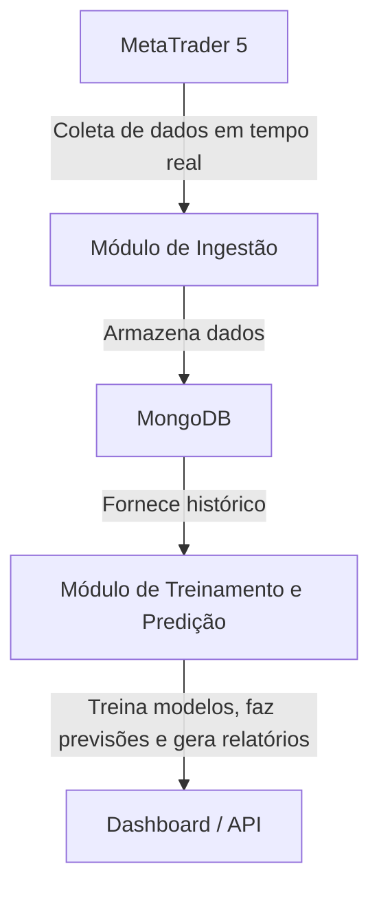

# 🧠 Tech Challenge - Fase 3 ✅

🎥 [**Apresentação do Projeto**](https://youtu.be/XkXVJ5hAtx4)
🗂️ [**Github**](https://github.com/IgorMartSan/FIAP---Tech-Challenge-Fase-3---ML)

Este repositório contém o desenvolvimento do **Tech Challenge - Fase 3**, focado na construção de um pipeline completo de **coleta**, **treinamento** e **previsão** de dados financeiros em tempo real, utilizando **Python**, **MongoDB** e **Machine Learning**.

---

## 📋 Checklist de Entregas

- [X] **API**
  - [X] Construir uma API que colete dados (Coleta de dados do MetaTrader)
  - [X] Armazenar os dados em:
    - [X] Banco de dados convencional (**MongoDB**)
    - [ ] Data Warehouse (DW)
    - [ ] Data Lake

- [X] **Modelo de Machine Learning**
  - [X] Selecionar e implementar um modelo de ML adequado
  - [X] Treinar o modelo utilizando a base de dados coletada
  - [X] Garantir que o código do modelo esteja no GitHub com a devida documentação

- [X] **Documentação**
  - [X] Criar documentação clara do projeto no GitHub
  - [X] Explicar as etapas de coleta, armazenamento, preparação e modelagem

- [X] **Apresentação Visual (Storytelling)**
  - [X] Produzir um vídeo explicativo apresentando todas as etapas do projeto
  - [X] Disponibilizar o vídeo via link no YouTube
  - [ ] Incluir o link do vídeo e do repositório em um arquivo `.txt` para upload na plataforma

- [X] **Produtização**
  - [X] Modelo deve alimentar uma aplicação simples **ou**
  - [ ] Criar um dashboard para visualização dos resultados

---

## ⚙️ Estrutura do Projeto

O sistema foi dividido em **três módulos principais**, com responsabilidades bem definidas e comunicação fluida entre eles:

### 🟢 1. Módulo de Ingestão de Dados (`data_ingestion`)
Responsável por coletar dados **em tempo real** do **MetaTrader** a cada hora e salvar no **MongoDB**.

#### Funcionalidades:
- Conecta-se à API do MetaTrader 5.
- Obtém dados de **candles (open, high, low, close, volume)**.
- Armazena os dados em uma coleção MongoDB particionada por data/hora.
- Pode ser executado de forma contínua ou agendada (via cron/Task Scheduler).

#### Tecnologias:
- Python  
- MetaTrader5 API  
- MongoDB  
- Pandas  

---

### 🧩 2. Módulo de Treinamento/Predição (`model_training`)
Responsável por treinar e validar o modelo de Machine Learning com base nos dados armazenados no banco. Além, usar o modelo treinado para **prever o movimento futuro** do ativo e alimentar um painel CMD.

#### Funcionalidades:
- Extrai dados históricos do MongoDB.
- Pré-processa e normaliza os dados.
- Cria janelas temporais (sequências) para aprendizado supervisionado.
- Treina modelos (ex: **LSTM**, **MLP** ou **Regressão Logística**) para prever a **direção do preço (subida/queda)**.
- Avalia o desempenho com métricas de **acurácia, precisão**.
- Executa as previsões em tempo real (ex: se o preço vai **subir**, **cair** ou **manter**).
- Retorna os resultados para o usuário final ou dashboard.

#### Tecnologias:
- Python  
- PyTorch / Scikit-Learn  
- Pandas / NumPy  

---

### 🔮 3. Módulo de Predição (`prediction_service`)
Responsável por usar o modelo treinado para **prever o movimento futuro** do ativo e alimentar um painel ou API.

#### Funcionalidades:
- Carrega o modelo mais recente salvo no módulo de treino.
- Recebe novos dados do MongoDB ou via API.


#### Tecnologias:
- Python  
- FastAPI (para servir o modelo)  
- Pandas / NumPy  
- Matplotlib ou Plotly (para gráficos)  

---

## 🗂️ Estrutura de Pastas (exemplo)

```bash
tech_challenge_fase3/
│
├─ 1_data_ingestion/
│   ├── main.py              # Script de coleta do MetaTrader
│   ├── metatrader_client.py # Cliente de conexão
│   └── mongo_handler.py     # Conexão e inserção no MongoDB
│
├─ 2_model_training/
│   ├── train_model.py       # Treinamento principal
│   ├── utils.py             # Funções auxiliares (métricas, split etc.)
│   └── models/              # Modelos salvos
│
├─ requirements.txt
├─ README.md
└─ .env                     # Variáveis de ambiente (credenciais)
```

---

## 🚀 Fluxo Geral do Projeto



# 📖 Storytelling do Projeto — Tech Challenge Fase 3

Em um cenário financeiro cada vez mais dinâmico e competitivo, a agilidade em identificar tendências e antecipar movimentos de mercado pode representar a diferença entre o lucro e o prejuízo. Assim, este projeto busca unir engenharia de dados, aprendizado de máquina e automação contínua para criar um sistema que aprende com o histórico e se adapta em tempo real às mudanças do mercado.

Foi assim que nasceu este projeto, estruturado em **dois módulos principais**, cada um representando uma etapa fundamental da jornada de dados.

---

## 🧩 1. Módulo de Ingestão de Dados

Tudo começa com a coleta automatizada de informações em tempo real.  
A aplicação é responsável por **capturar dados de mercado** (como preços, volume e variações) a cada hora e armazená-los de forma segura no **MongoDB**.  

Essa camada garante que as informações estejam sempre atualizadas e acessíveis, servindo como base para o aprendizado do modelo.

---

## 🧠 2. Módulo de Treinamento/Previsão de Machine Learning

Com os dados em mãos, entra em cena a inteligência.  
Aqui, o modelo de **aprendizado de máquina (ML)** é treinado utilizando técnicas supervisionadas, como **Random Forest**, **XGBoost** e **redes neurais simples**.  

O objetivo é **prever a direção futura do preço** — se ele vai subir ou cair — e medir o quanto o modelo acerta, permitindo ajustes constantes e melhoria de performance ao longo do tempo.

---

## ⚙️ 3. Módulo de Previsão e Aplicação

O terceiro módulo leva a teoria à prática.  
Ele utiliza o modelo treinado para **gerar previsões em tempo real** e alimentar uma **API** ou **dashboard**, permitindo que usuários ou sistemas externos visualizem os resultados e tomem decisões baseadas em dados concretos.  

Essa etapa transforma o modelo em algo **produtivo**, integrando o aprendizado com aplicações do mundo real.

---

## 🚀 Impacto e Aprendizado

Mais do que um exercício técnico, este projeto representa uma **integração completa entre engenharia de dados e aprendizado de máquina**, formando uma pipeline capaz de:

- Coletar dados automaticamente;  
- Treinar modelos com base em padrões históricos;  
- Entregar previsões de forma acessível e visual.

Ao final, o sistema não apenas prevê números — ele **conta uma história de evolução**, mostrando como dados brutos se transformam em **inteligência preditiva**, com aplicações reais no mercado financeiro e em qualquer cenário orientado por dados.

---

---

## 📈 Resultados Esperados

- Coleta automatizada de dados financeiros.
- Pipeline completo e modularizado.
- Modelo capaz de prever a direção do preço (subida/queda).
- Integração simples com APIs ou dashboards para visualização em tempo real.

---


